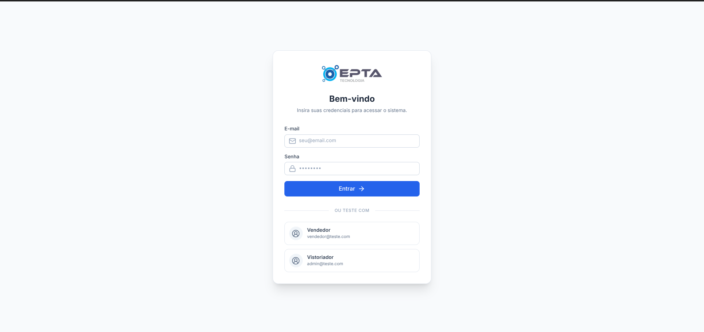
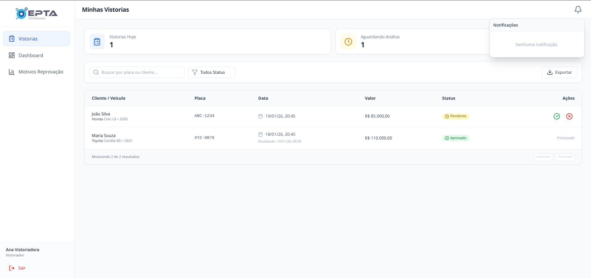
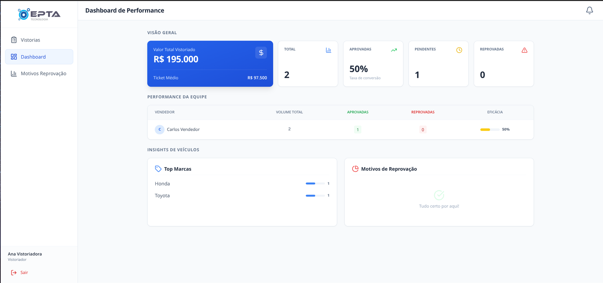
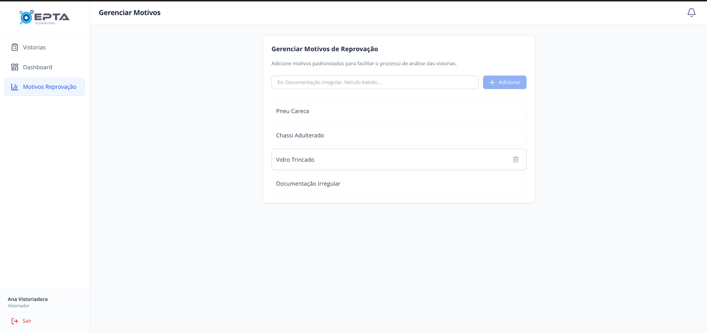
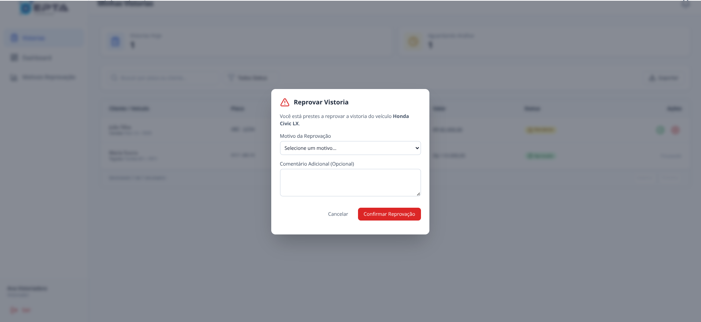
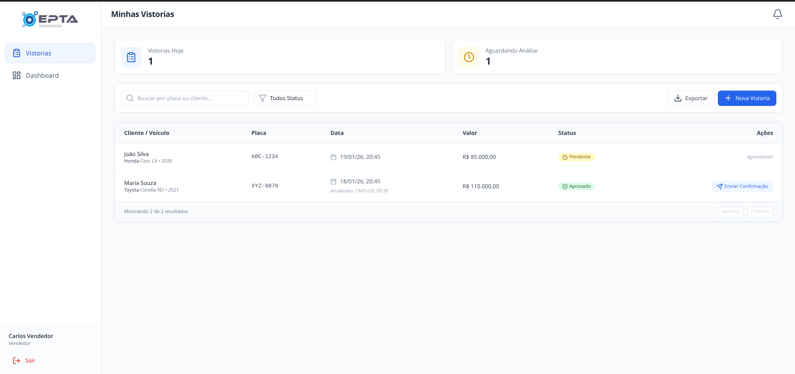
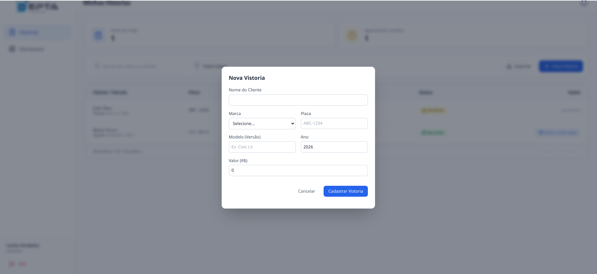

# 🚗 Prova Técnica — Sistema de Vistorias + Notificações

Desafio técnico para vaga de Desenvolvedor(a) Fullstack Júnior 3.
O objetivo é avaliar o domínio no desenvolvimento de uma aplicação completa, focando em: modelagem de dados, autenticação, controle de fluxo de estados (workflow) e boas práticas de arquitetura (Clean Code e desacoplamento).

Obs.: O repositório deve conter um README com instruções de execução, um .env.example, scripts de migração/seed e os entregáveis descritos abaixo.

## 📋 Escopo (Obrigatório)

### 1. Login / Autenticação

A aplicação deve gerenciar 2 tipos de perfis (Roles):
Vendedor (Usuário Padrão): Quem inicia o processo e cadastra o associado.
Vistoriador (Admin/Master): Quem analisa e aprova/reprova a vistoria.
Requisitos:
O login deve ser realizado via JWT (JSON Web Token).
As rotas devem ser protegidas por Role (Ex: Um Vendedor não pode acessar a rota de "Aprovar Vistoria", nem o Vistoriador pode criar vistorias).
Dica: Crie um seed no banco de dados que já insira automaticamente 1 usuário de cada tipo (ex: vendedor@teste.com e admin@teste.com) para facilitar a correção.

### 2. Gestão de Motivos de Reprovação (CRUD Auxiliar)

Para padronizar o processo, o Vistoriador não deve apenas digitar um texto qualquer ao reprovar.
Funcionalidade: O sistema deve permitir que o usuário Vistoriador cadastre, edite e exclua "Motivos de Reprovação" (Ex: "Pneu Careca", "Chassi Adulterado", "Vidro Trincado").
Uso: No momento de reprovar uma vistoria (no passo de Análise), o sistema deve exigir que o Vistoriador selecione um desses motivos previamente cadastrados em um Select.

### 3. Fluxo de Trabalho (O Core do Desafio)

O sistema deve seguir estritamente a seguinte ordem de eventos:
Passo 1: Criação (Ação do Vendedor)
O Vendedor acessa o sistema e cadastra uma nova vistoria.
Dados obrigatórios: Nome do Cliente, Placa, Modelo do Veículo, Ano e Valor.
Ao salvar, o status inicial da vistoria deve ser PENDENTE.

🔔 Gatilho: No momento da criação, o sistema deve gerar uma notificação para o perfil Vistoriador.
Análise (Ação do Vistoriador)
O Vistoriador visualiza uma lista de vistorias pendentes.
Ele pode clicar em APROVAR ou REPROVAR.
Condição de Reprovação: Se optar por reprovar, ele deve selecionar um Motivo de Reprovação (vindo do CRUD do item 2) e opcionalmente adicionar um comentário em texto.

🔔 Gatilho: Ao alterar o status, o sistema deve gerar uma notificação de volta para o Vendedor (dono daquela vistoria) avisando o resultado.
Passo 3: Conclusão (Ação do Vendedor)
O Vendedor visualiza o novo status da vistoria na listagem.
Regra de Ouro da UI: Caso o status seja APROVADO, um novo botão chamado "Enviar Confirmação ao Cliente" deve aparecer na tela (esse botão pode apenas exibir um alert ou toast simulando o envio). Se estiver PENDENTE ou REPROVADO, esse botão deve ficar oculto ou desabilitado.

### 4. Sistema de Notificações

Não queremos apenas um CRUD. O sistema de notificação deve ser integrado ao fluxo acima.
Componente Visual: Deve haver um ícone de "Sino" no topo da aplicação (Header).
Contador (Badge): O ícone deve mostrar o número de notificações não lidas.
Listagem: Ao clicar no sino, o usuário vê as mensagens direcionadas a ele.
Leitura: Deve haver uma forma de marcar a notificação como lida (seja clicando nela ou num botão "Marcar como lida"), o que deve diminuir o contador e remover o destaque visual.

### 5. Listagem, Filtros e Relatórios

A listagem de vistorias não pode ser apenas um SELECT \* simples. O sistema deve suportar alto volume de dados:
Paginação:
A API deve retornar os dados paginados (Ex: 10 itens por página).
O Front-end deve ter componentes de navegação ("Próximo", "Anterior" ou números de página).
Filtros Avançados:
O usuário deve poder filtrar a lista por: Status (Aprovado/Reprovado/Pendente) e Busca por Placa.
Exportação (Relatório):
Deve haver um botão "Exportar para Excel" (XLSX ou CSV).
O arquivo gerado deve respeitar os filtros aplicados na tela (Ex: Se filtrei apenas "Aprovados", o Excel só baixa os aprovados).
Colunas do Relatório: Nome do Cliente, Placa, Modelo, Data de Criação, Status e Motivo da Reprovação (se houver).

## 🛠️ Stack e Requisitos Técnicos

Backend (API)
Linguagem/Framework: Node.js com NestJS ou Fastify.
Banco de Dados: PostgreSQL.
ORM: Prisma, TypeORM ou Drizzle.
Arquitetura: Esperamos ver uma separação clara de responsabilidades. A lógica de criar a notificação não deve estar acoplada dentro do método de criar vistoria (Sugestão: Use Services distintos, Observers ou Events).
Frontend (Web)
Framework: React (Vite) ou Next.js.
Linguagem: TypeScript.
Estilização: TailwindCSS (Shadcn/UI é bem-vindo, mas opcional).
Gerenciamento de Estado: O contador de notificações deve reagir às ações do usuário sem precisar de F5.
Atualização de Dados: Você pode escolher como a tela recebe as novas notificações:
Nível 1 (Básico): Botão de refresh manual.
Nível 2 (Intermediário - Recomendado): Polling (busca automática a cada X segundos).
Nível 3 (Avançado): WebSockets.

## 📦 Entregáveis Esperados

Para submeter o desafio, certifique-se de cumprir os itens abaixo:
Repositório Git: Link do repositório público GitHub com o histórico de commits (evite um único commit "initial commit").
Instruções de Rodagem: O README.md deve conter um passo-a-passo claro de como rodar o projeto localmente (Ex: npm install, docker compose up, etc).
Seed Database: Um comando ou script (npm run seed) que popule o banco com pelo menos 1 usuário Vendedor e 1 usuário Vistoriador para que possamos testar sem criar conta do zero.
Vídeo Demo (Opcional): Um link curto (Loom, YouTube não listado) de até 2 min mostrando o fluxo funcionando.

### 💡 Sugestões de diferenciais que valorizam o candidato

Não são obrigatórios, mas contam pontos extras na avaliação:

🐳 Docker Compose: Para rodar banco e API com um único comando.

🧪 Testes Unitários: Pelo menos um teste cobrindo a lógica de serviço ou um componente crítico.

🛡️ Validação de Campos: Uso de Zod e React Hook Form (Ex: validar formato de placa ou campos vazios).

📡 Websockets: Para atualização em tempo real.

⚡ TanStack Query: Para gerenciamento de cache e requisições no front.

🐻 Zustand: Para gerenciamento de estado global (caso necessário).

♾️ Paginação via Cursor: Implementação de Infinite Scroll utilizando cursor-based pagination (performance superior ao offset padrão).
